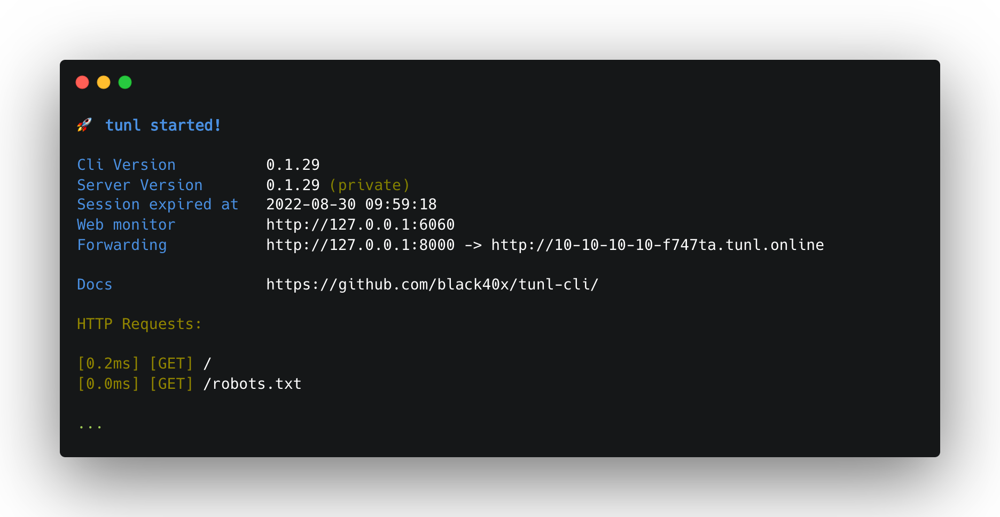
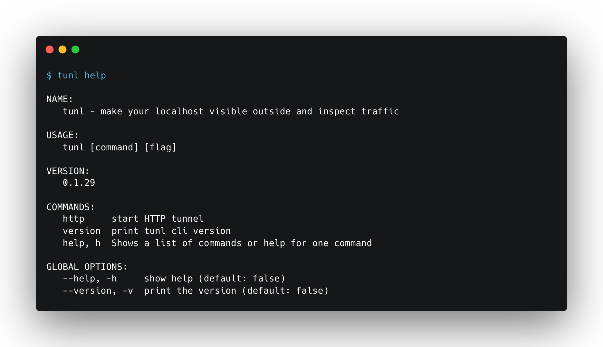
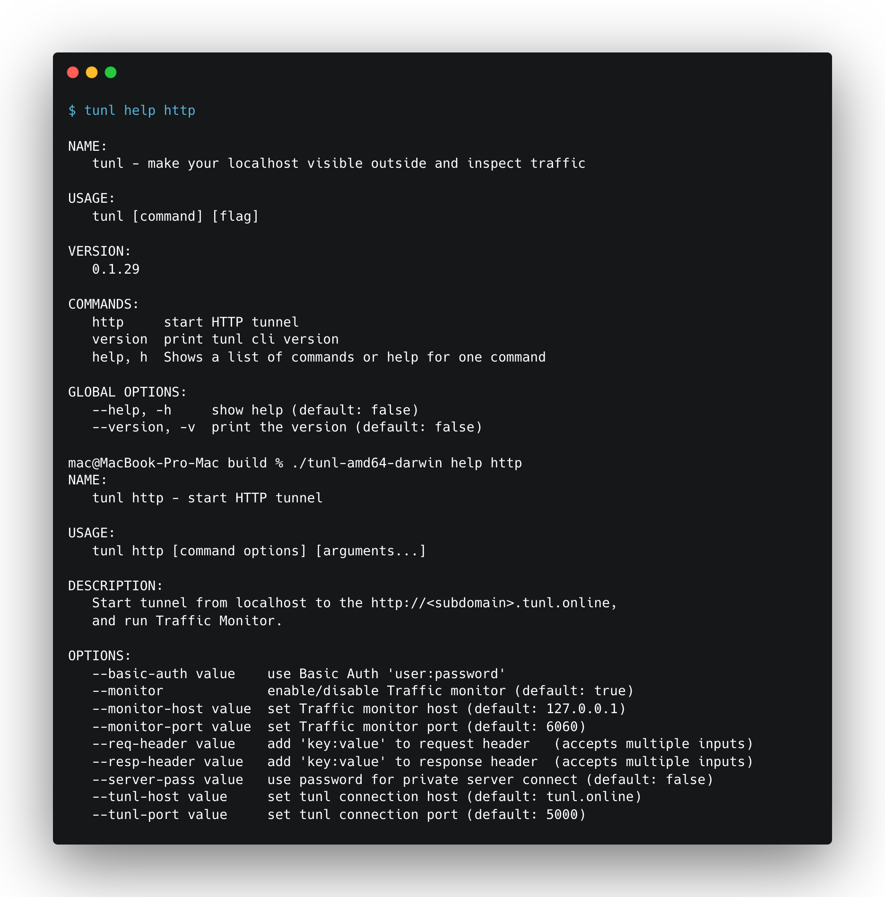

# tunl-cli

[](LICENSE)

The open-source developer platform for share localhost and inspect incoming traffic.



Tunl allows you to share local port, IP or URL address by HTTP protocol, view incoming requests:

- **Easy publish:** your localhost to internet.
- **Traffic monitor:** easy tool for inspect incoming traffic with view of request form data, json.
- **Basic Auth:** protect your tunnel with username and password.
- **Add headers:** to your requests and responses.

**NOTE:** current version in alpha mode. Monitor port flag not supported yet. Tunl.online server currently private.

[Download](https://github.com/black40x/tunl-cli/releases)





## Example commands

```
tunl http -tunl-server <your-server> 8000
```
```
tunl http -tunl-server <your-server> 192.168.1.10:8000
```
```
tunl http -tunl-server <your-server> dir://<path-to-directory>
```
```
tunl http -tunl-server <your-server> -basic-auth login:pass 8000
```

## Build

Install npm and go 1.19

```
go mod tidy
go run build.go
```

## License

Tunl.online is distributed under [AGPL-3.0-only](LICENSE).

