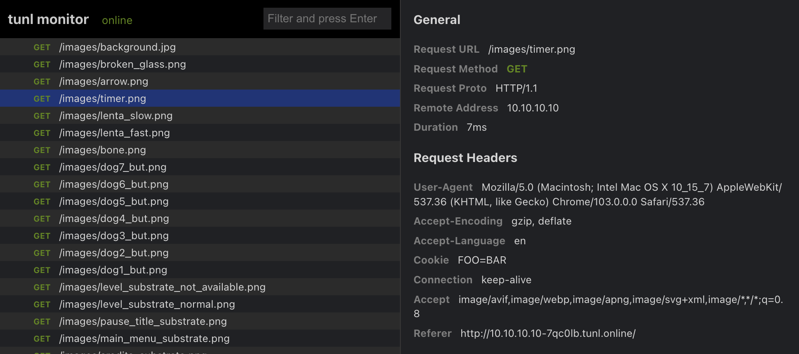

# tunl-cli

[](LICENSE)

The open-source developer platform for share localhost and inspect incoming traffic.

Tunl allows you to share local port, IP or URL addres by HTTP protocol, view incomming requests:

- **Easy publsh:** your localhost to internet.
- **Traffic monitor:** easy tool for inspect incomming traffic with view of request form data, json.
- **Basic Auth:** protect your tunnel with user name and password.
- **Add headers:** to your requests and responses.

**NOTE:** current version in alpha mode.

[Releases](https://github.com/black40x/tunl-cli/releases)

## Build

Install npm and go 1.19

```
go get
go run build.go
```

## Example

Share local port:

```
tunl http -tunl-server <your-server> 8000
```

Share IP address:

```
tunl http -tunl-server <your-server> 192.168.1.10:8000
```

Example output:

```
🚀 tunl started!

Cli Version          0.1.29
Server Version       0.1.29 (public)
Session expired at   2022-08-30 00:03:48
Web monitor          http://127.0.0.1:6060
Forwarding           http://127.0.0.1:8000 -> http://127-0-0-1-u8g75l.tunl.online

Docs                 https://github.com/black40x/tunl-cli/

HTTP Requests:  

[5.9ms] [GET] /
...
```



## Warning

Monitor port flag not used.

## License

Tunl.online is distributed under [AGPL-3.0-only](LICENSE).

