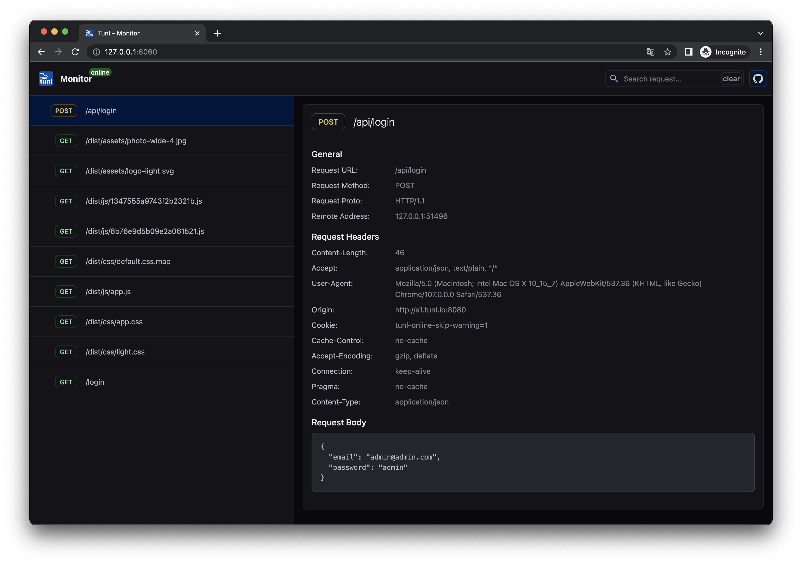

# tunl-cli

[](LICENSE)

Tunl - the open-source developer platform for:

- Inspect incoming traffic
- Debug callback's and WebHook's
- Show localhost without deploy

Tunl allows you to share local port, IP or URL address to the internet, view incoming requests:

- **Easy publish:** your localhost to internet.
- **Traffic monitor:** easy tool for inspect incoming traffic with view of request form data and json.
- **Basic Auth:** protect your tunnel with username and password.
- **Add headers:** to your requests and responses.

[Download](https://github.com/black40x/tunl/releases) the latest release. Also, you can start your own server with [tunl-server](https://github.com/black40x/tunl-server).



## Example commands

```
tunl http 8000
```
```
tunl http 192.168.1.10:8000
```
```
tunl http dir://<path-to-directory>
```
```
tunl http -basic-auth login:pass 8000
```

## Build

Install npm and go 1.19

```
git clone git@github.com:black40x/tunl.git
cd tunl
make
```

or 

```
go install github.com/black40x/tunl@latest
```

## License

Tunl.online is distributed under [AGPL-3.0-only](LICENSE).

